# praktikum-git-560235

## Deskripsi Proyek
Proyek ini adalah tugas praktikum mata kuliah Pemrograman dan Pengembangan Web (PPW). Proyek ini berisi halaman profil sederhana menggunakan HTML dan CSS yang dikelola dengan *version control system* *Git* dan repositori *GitHub*. Tujuan utama proyek ini adalah menerapkan alur kerja *Git* yang terstruktur, seperti pembuatan *branch*, penyelesaian *merge conflict*, pembuatan *pull request*, dan manipulasi riwayat *commit* menggunakan *interactive rebase*.

## Dokumentasi Perintah Git
Berikut adalah daftar perintah *Git* yang digunakan selama praktikum beserta penjelasan fungsinya:

*   `git init` : Menginisialisasi *repository* *Git* baru di *folder* lokal agar perubahan *file* dapat dilacak.
*   `git clone [url]` : Mengunduh (menyalin) *repository* dari *server* *GitHub* ke komputer lokal.
*   `git add [nama-file]` atau `git add .` : Memasukkan perubahan *file* ke dalam *staging area* sebelum disimpan ke riwayat *commit*.
*   `git commit -m "[pesan]"` : Menyimpan perubahan secara permanen ke *repository* lokal beserta pesan yang mengikuti standar *Conventional Commits*.
*   `git push origin [nama-branch]` : Mengunggah *commit* dari komputer lokal ke *repository* *GitHub*.
*   `git pull origin [nama-branch]` : Mengambil *update* kode terbaru dari *GitHub* dan menggabungkannya ke *branch* lokal yang sedang aktif.
*   `git log --oneline --graph` : Menampilkan riwayat *commit* dan visualisasi *branch* secara ringkas dalam satu baris.
*   `git checkout -b [nama-branch]` : Membuat *branch* baru sekaligus langsung berpindah ke *branch* tersebut.
*   `git checkout [nama-branch]` : Berpindah ke *branch* lain yang sudah ada.
*   `git merge [nama-branch]` : Menggabungkan *branch* lain ke dalam *branch* yang sedang aktif.
*   `git rebase -i HEAD~3` : Melakukan *interactive rebase* untuk menyatukan (*squash*) tiga *commit* terakhir menjadi satu *commit* agar riwayat lebih rapi.

## Lampiran Dokumentasi Proses Praktikum

Berikut adalah dokumentasi proses penyelesaian *issue*, pembuatan *pull request*, penyelesaian *conflict*, dan pengelolaan *repository* selama praktikum:

### 1. Tugas 1: Inisialisasi & Commit History

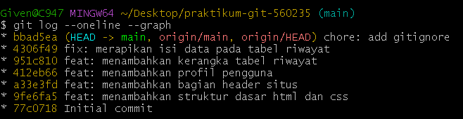
*Tangkapan layar riwayat commit lokal menggunakan perintah `git log --oneline --graph` untuk melihat alur branch dan commit secara ringkas.*

### 2. Tugas 2: Branching & Pull Request

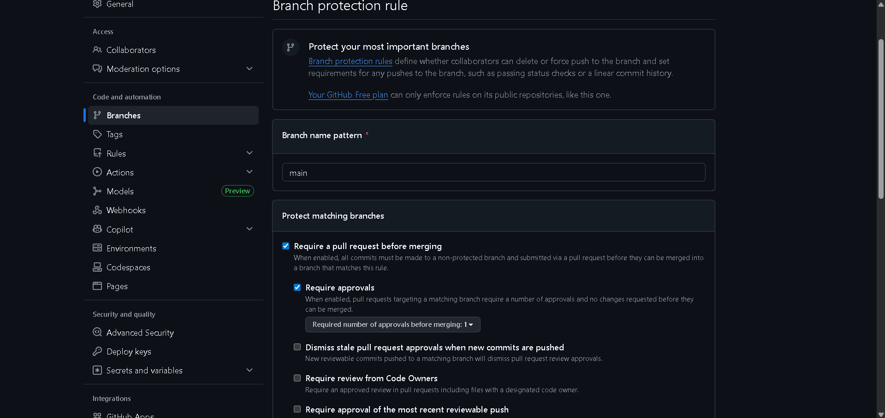
*Pengaturan Branch Protection Rule di GitHub agar branch utama wajib melalui pull request sebelum di-merge.*

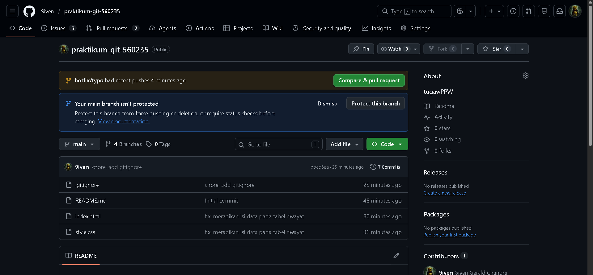
*Tampilan saat membuat pull request untuk membandingkan kode dari branch fitur ke branch utama.*

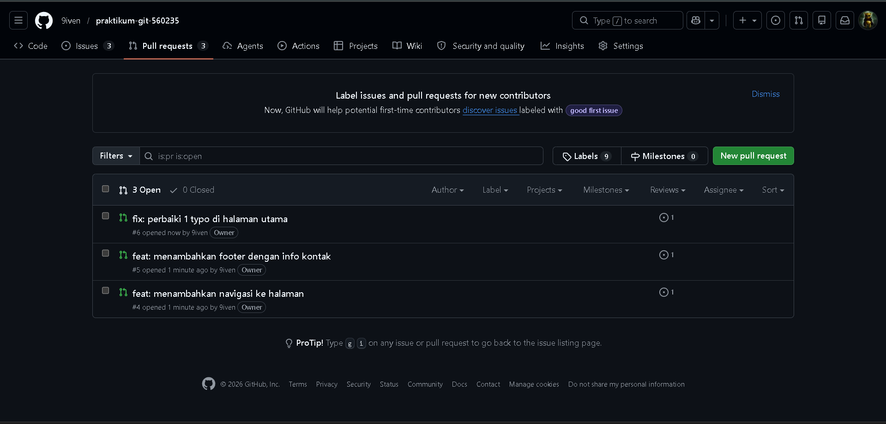
*Daftar tiga pull request yang berhasil dibuat dari masing-masing branch (feature/navbar, feature/footer, dan hotfix/typo).*

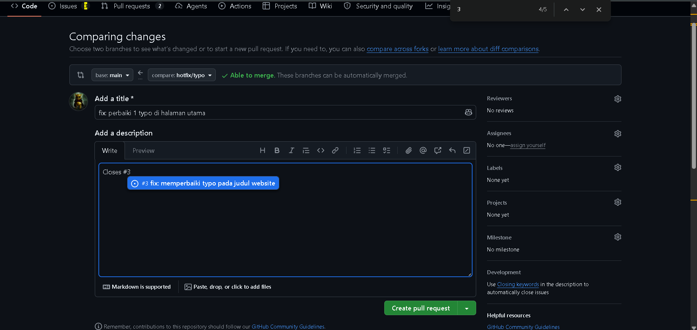
*Penggunaan format "Closes #1" pada deskripsi pull request untuk menutup issue secara otomatis.*

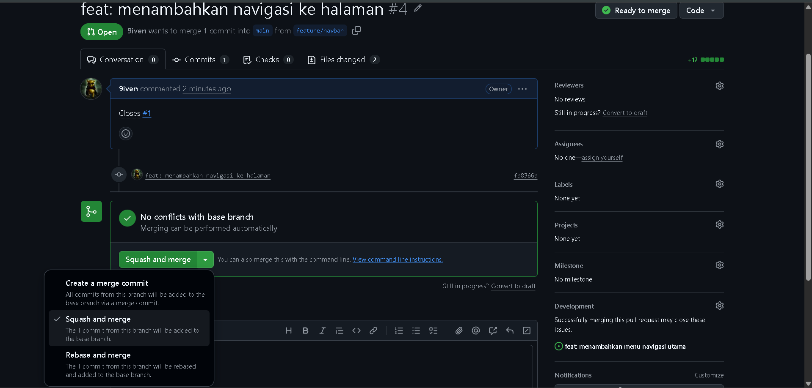
*Pemilihan opsi Squash and merge untuk menggabungkan branch fitur agar riwayat commit di main tetap bersih.*

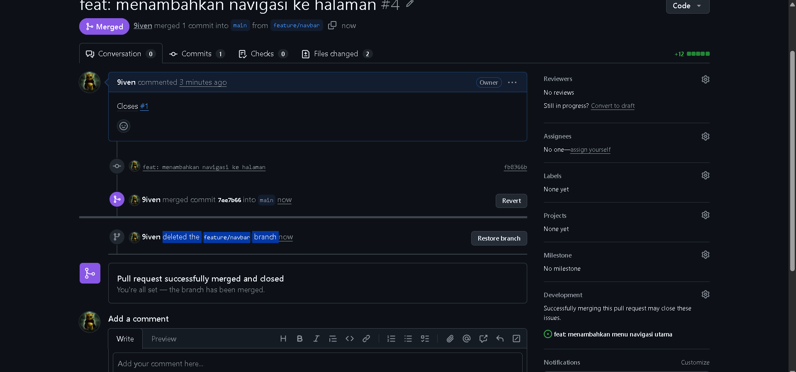
*Proses penghapusan branch dari GitHub setelah pull request selesai di-merge.*

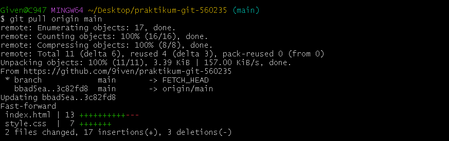
*Proses `git pull origin main` di terminal lokal untuk mengambil update terbaru dari GitHub sebelum lanjut ke tugas berikutnya.*

### 3. Tugas 3: Konflik & Rebase

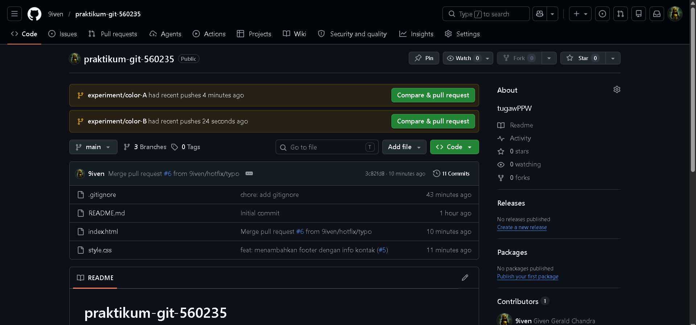
*Proses pembuatan branch experiment/color-A dan experiment/color-B untuk menyiapkan simulasi merge conflict.*

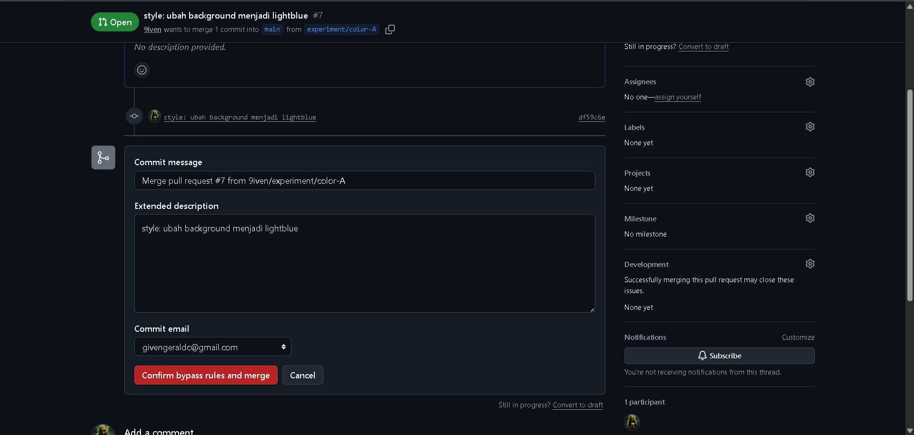
*Penggunaan opsi bypass di GitHub untuk melakukan merge pada branch eksperimen pertama tanpa harus menunggu ulasan.*

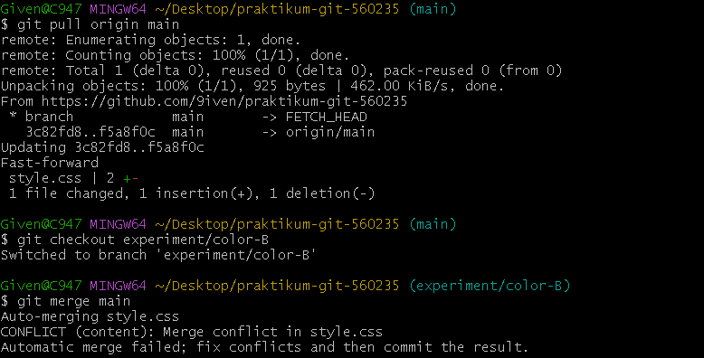
*Pesan error di terminal yang menunjukkan terjadinya merge conflict pada file style.css.*

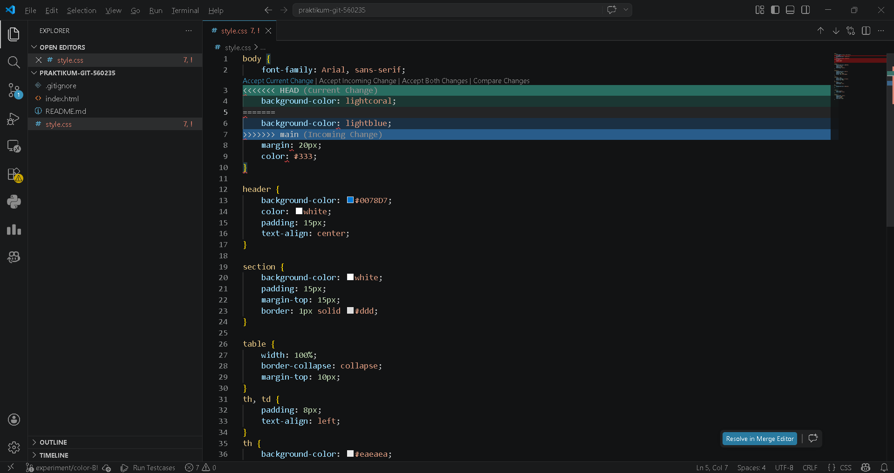
*Proses penyelesaian konflik secara manual di VS Code dengan memilih kode yang benar dan menghapus batas konflik (<<<<<<<, =======, >>>>>>>).*

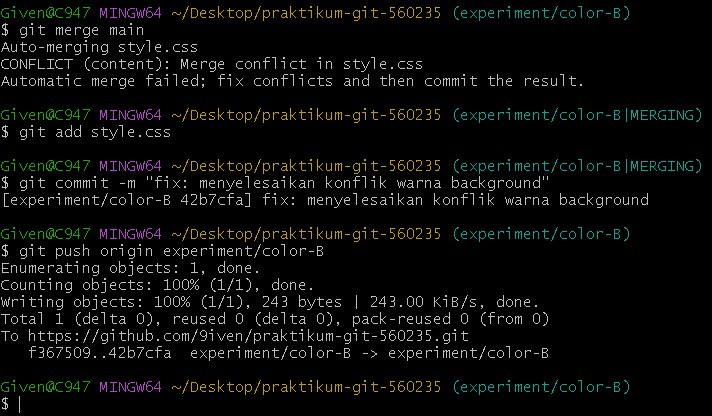
*Perintah git commit dan git push untuk menyimpan hasil perbaikan konflik ke GitHub.*

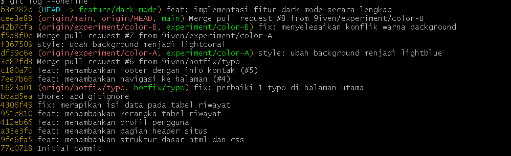
*Tiga commit terpisah di branch feature/dark-mode sebelum dilakukan rebase.*

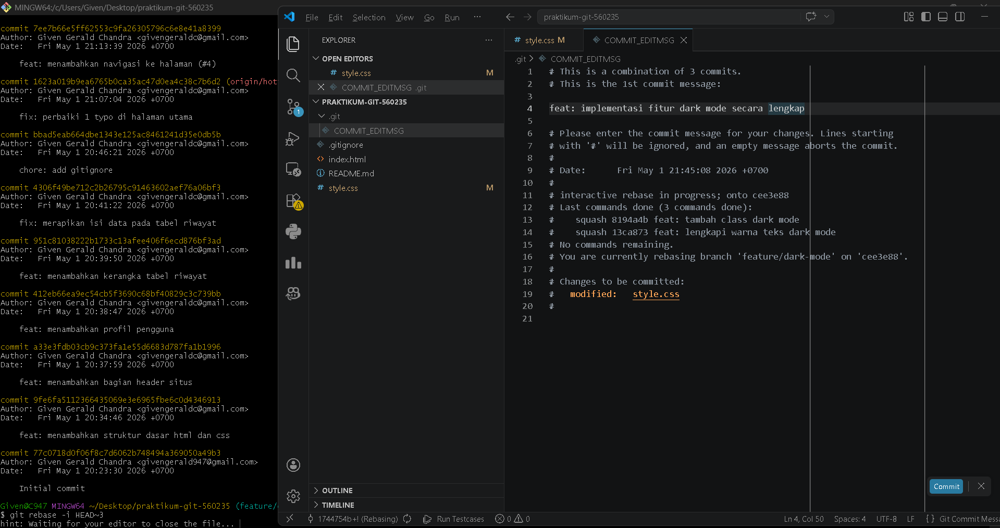
*Tampilan editor saat proses interactive rebase untuk mengubah perintah `pick` menjadi `squash`.*

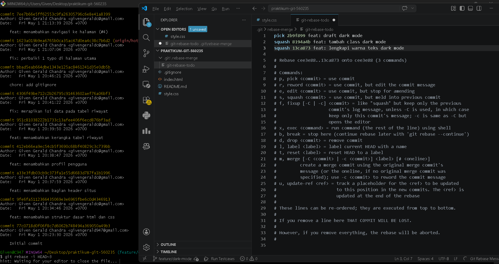
*Tampilan editor untuk menggabungkan pesan commit menjadi satu pesan akhir yang lebih rapi.*

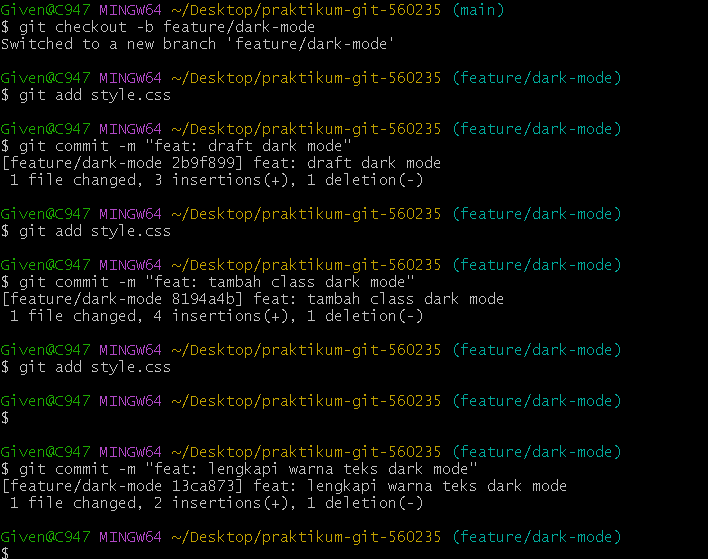
*Hasil akhir riwayat commit setelah rebase, di mana tiga commit berhasil digabung menjadi satu.*

### 4. Tugas 4: Dokumentasi & Release

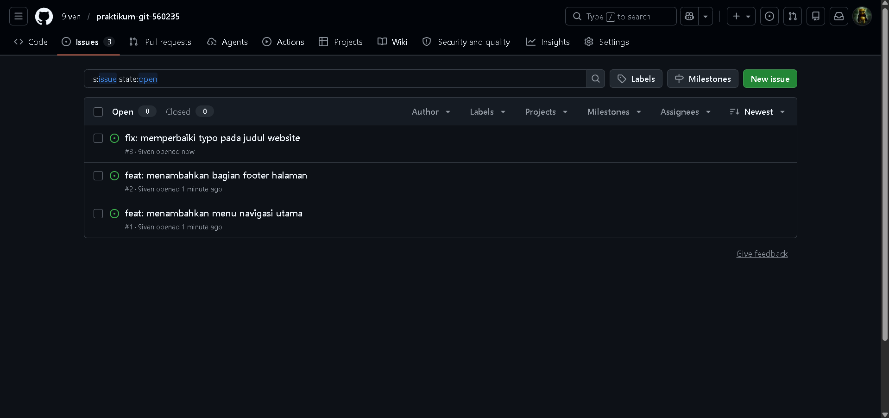
*Tampilan GitHub yang menunjukkan bahwa issue telah otomatis tertutup (closed) setelah pull request di-merge.*